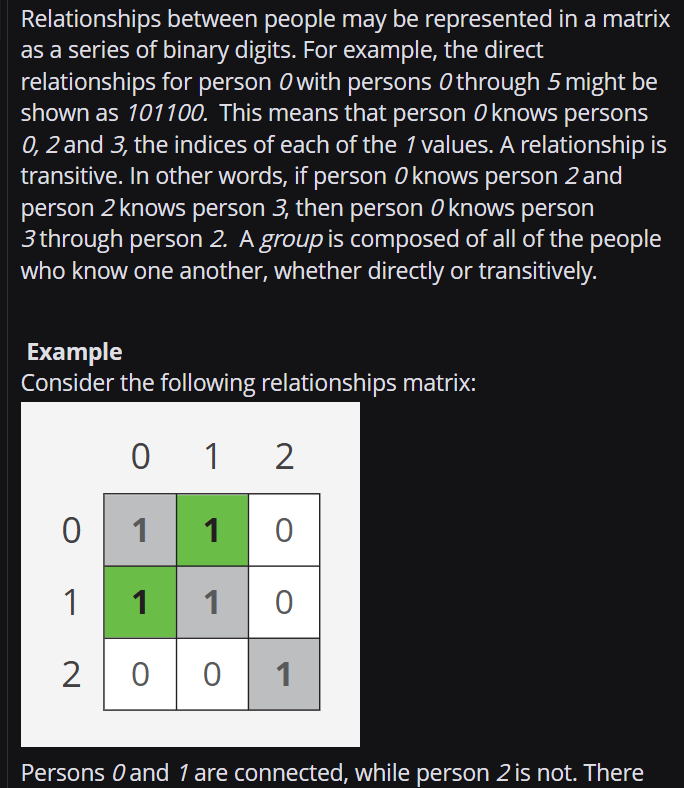

/*
Task manager
- add(task) function to take in a task to be assigned. Each task associated with a company.
- dispatch() function, called externally on regular interval
- dispatch function to send task to one of the company allocated servers. Task can be assigned to a server only if it is free.
- each server has a current status check endpoint to tell if it is busy/not.
- each company could have multiple servers available.
  */

Question 2: img.png

